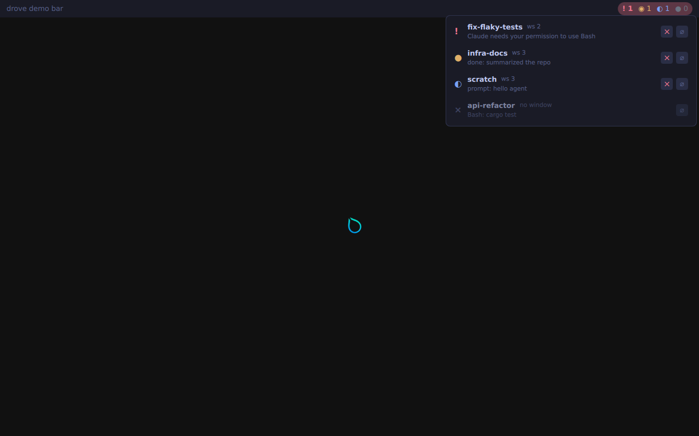

# drove for Quickshell

A bar widget and popup panel for [Quickshell](https://quickshell.org) that talk
to the drove daemon over its unix-socket NDJSON protocol
(`docs/protocol.md`). Pure QML, no dependencies beyond `Quickshell` and
`Quickshell.Io`. Developed against quickshell 0.3.x.

| file | what |
|---|---|
| `DroveService.qml` | `pragma Singleton`. Connects to `$DROVE_SOCKET` or `$XDG_RUNTIME_DIR/drove/drove.sock`, sends `subscribe`, keeps a sorted `agents` array, counts, reconnects with backoff (0.5s to 5s). A second socket carries requests. |
| `DroveWidget.qml` | Compact bar module: `! n  ◉ n  ◐ n  ● n`. Pulses red while anything needs input. Left click = `next`, right click = toggle the panel. |
| `DrovePanel.qml` | `PopupWindow` listing agents (status glyph and colour, name, workspace, detail, `(guess)` for `maybe`, `adopted` badge). Click a row = focus; `×` closes the window; `⌀` forgets the agent. |
| `shell.qml` | Standalone demo bar, plus an `IpcHandler` (`target: "drove"`) used by the VM test. |

## Try it

```sh
python3 tools/mock-drove.py --socket /tmp/drove-mock.sock &
DROVE_SOCKET=/tmp/drove-mock.sock quickshell -p ui/quickshell/shell.qml
# scripting (same instance):
quickshell ipc -p ui/quickshell/shell.qml call drove state
quickshell ipc -p ui/quickshell/shell.qml call drove next
quickshell ipc -p ui/quickshell/shell.qml call drove focus api-refactor
```

## Use it in your existing config

Copy (or symlink) the directory into your config, e.g.
`~/.config/quickshell/drove/`, and import it by path. Quickshell generates the
module definition (including the singleton) for you; no `qmldir` is needed.

```qml
// ~/.config/quickshell/shell.qml (or wherever your bar lives)
import qs.drove            // ~/.config/quickshell/drove/

PanelWindow {
    // ... your bar ...
    Row {
        DroveWidget {}     // that's it; right-click opens DrovePanel under it
    }
}
```

Custom placement of the panel: `DroveWidget { embedPanel: false; onPanelRequested: myPanel.visible = !myPanel.visible }`
with your own `DrovePanel { anchorItem: someItem }`. Colours are plain properties
(`alertColor`, `workingColor`, ...) on the widget and panel.

From your own QML you can use the service directly:

```qml
Text { text: DroveService.needsInput > 0 ? "agent needs you" : "" }
Button { onClicked: DroveService.next() }
```

### Service API

Properties: `connected`, `agents` (sorted array of protocol agent objects),
`needsInput`, `attention` (attention flag, not needs_input), `working`, `idle`
(the last two exclude agents with the attention flag; exited agents count
nowhere), `total`, `lastError`, `socketPath`.

Functions: `focus(id)`, `next()`, `close(id)`, `forget(id)`,
`send(id, text, enter = true)`, `request(method, params, cb)`; `id` may be
an id, unique name or prefix. Sort order is the one in `docs/protocol.md`.

## Testing

* **Static:** `ui/quickshell/lint.sh` runs `qmllint` on a temp copy that has a
  `qmldir` (Quickshell makes one at runtime). Needs `QT_QML` (qtdeclarative's
  `lib/qt-6/qml`) and quickshell on `PATH` or `QS_QML`. Remaining warnings are
  qmllint gaps for Quickshell's own types (`PanelWindow` not creatable, popup
  anchor enums, `QLocalSocket::LocalSocketError`), not real errors.
* **Real run:** `nix build -L .#checks.x86_64-linux.vm-quickshell` boots
  Hyprland in a QEMU VM (see `nix/README.md`), starts `mock-drove.py` on the
  default socket path, launches `quickshell -p shell.qml`, and asserts:
  the mock sees exactly one `subscribe`; the model/counts arrive; `next`,
  `focus`, `send_text` and `close` issued through `qs ipc call` reach the
  daemon with the right params (over the request connection); the close event
  updates counts through the subscription; and killing/restarting the daemon
  makes the service reconnect and resubscribe. A screenshot with the panel
  open is saved as `screenshots/quickshell.png`.
  Mouse clicks on the widget itself are not synthesised in the VM (no input
  injection there); the click handlers call the same `DroveService` functions
  that the IPC handler does.



Note: sockets are re-created (via `Loader`) on every reconnect attempt;
re-toggling `connected` on a Socket whose connect failed did not retry in the VM.
